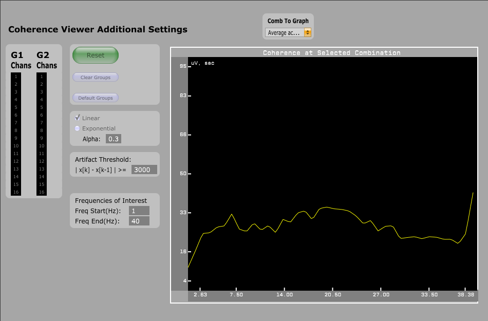

# Coherence Viewer
This plugin for the [Open Ephys GUI](https://github.com/open-ephys/plugin-GUI) preforms real time coherence estimation between two groups of channels. The primary purpose of this plugin is to visualize the coherence between two brain regions in real time to get feedback on the effects of a stimulus - electrical/opto stimulation, task or environmental changes, etc. The plugin allows the user to choose channels to correspond to two different groups. Each channel combination between the two groups will be analyzed. Individual combinations or the average across all combinations can be chosen as the visualization. See [video](https://drive.google.com/open?id=1Qn3aU0Fl4xd-TCFRlrGKvbNjoVNFkC9a).

## Installation
This plugin must now be built outside of the main GUI file tree using CMake. In order to do so, it must be in a sibling directory to plugin-GUI\\ and the main GUI must have already been compiled.

You must also first install the "OpenEphysFFTW" common library, available [here](https://github.com/tne-lab/OpenEphysFFTW/tree/master).

See `CoherenceViewer/CMAKE_README.txt` and/or the wiki page [here](https://open-ephys.atlassian.net/wiki/spaces/OEW/pages/1259110401/Plugin+CMake+Builds) for build instructions.

If you have the GUI built somewhere else, you can specify its location by setting the environment variable `GUI_BASE_DIR` or defining it when calling cmake with the option `-DGUI_BASE_DIR=<location>`.

----
## Usage
1. Choose channels in G1/G2 Chans to be split into groups. Default is first half of channels in G1 and second half in G2.
2. Choose whether to have a linear or exponential running average of the coherence.

   Exponential determined by equation ...
3. Set a microvolt threshold for artifact detection. The plugin will discard buffers with an artifact. A pop up will appear after the first discarded buffer to warn users that not all information is used.
4. Set you frequencies of interest. Click the Reset button to set up the plugin.
5. Start acquisition!

   \* If recording a second experiment, click **reset** again to flush buffers and reset coherence.

----
If recording. The coherence output after each window will be saved in recording directory.
This is still in an experimental form and will be improved on in the future.

----
### Development
Note this plugin is still in active development. There are still bugs to be found and functions to be implemented! Contact <markschatza@gmail.com> with any ideas!
